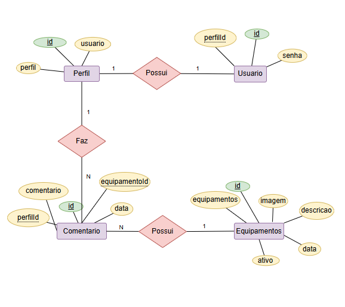

# API da Techman


## Para testar
- 1 Clone este repositório
- 2 Abra o XAMPP e inicie o MySQL
- 3 - 2 Abra o terminal `cmd` ou `bash` do Visual Studio Code e execute o comando `cd api` e para criar um arquivo package.json:
```bash
npm init -y
```
- 4 Instale as dependências basicas do projeto, instale o prisma com suporte ao MySQL.
```bash
npm install express cors dotenv
npm install prisma -g
npx prisma init --datasource-provider mysql
```
- 5 Crie o arquivo .env na raiz do projeto contendo
```js
DATABASE_URL="mysql://root@localhost:3306/techman?schema=public&timezone=UTC"
```
- 5 Edite o Shema do Prisma no arquivo `prisma/schema.prisma` para definir as tabelas `Perfil`, `Usuario`, `Equipamentos` e `Comentarios`

- 6 Crie e edite o arquivo `server.js`
-  
- 7 Execute o comando `npx prisma migrate dev --name init` para criar as tabelas no banco de dados MySQL.<br>Se precisar resetar o prisma o comando é `npx prisma migrate reset`.
- 8 Execute a API e teste a rota inicial no navegador.
```bash
npx nodemon
```