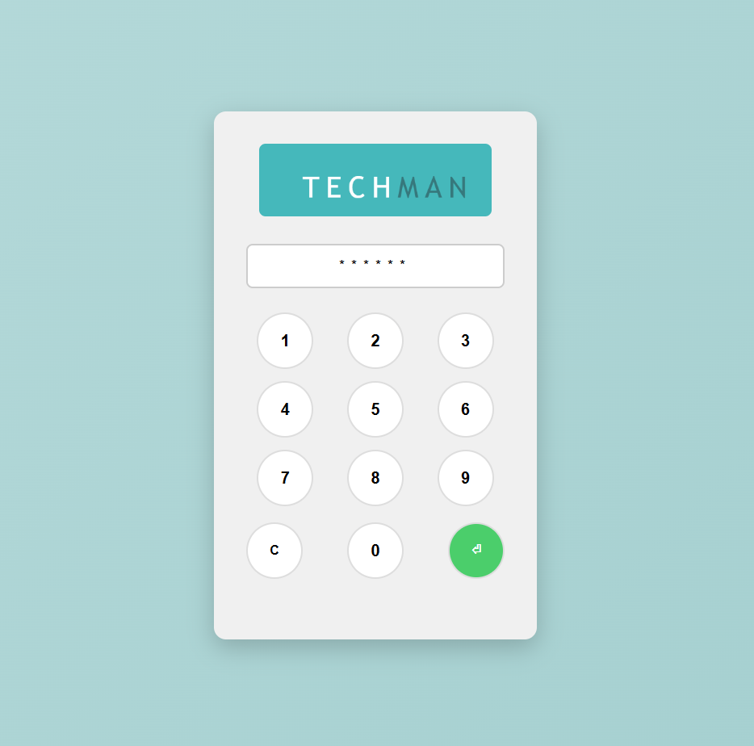
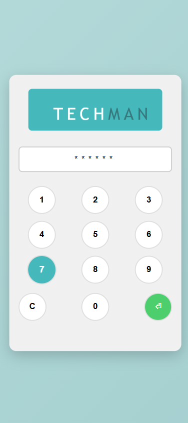
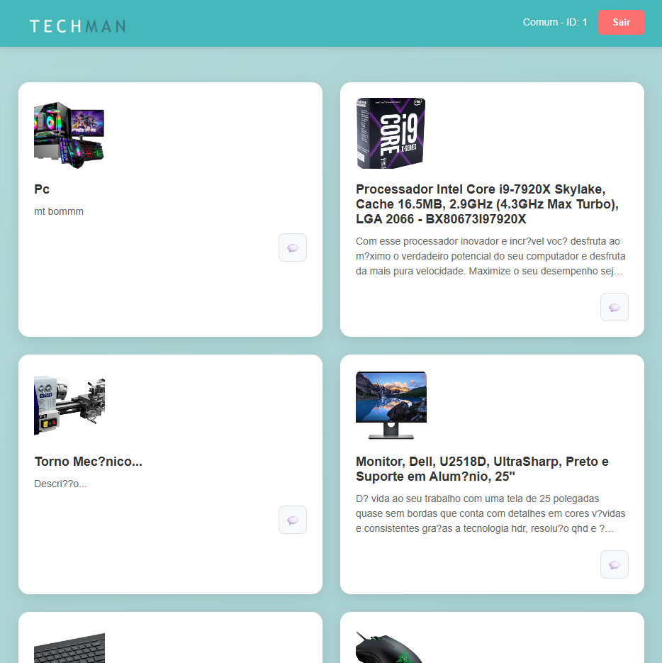
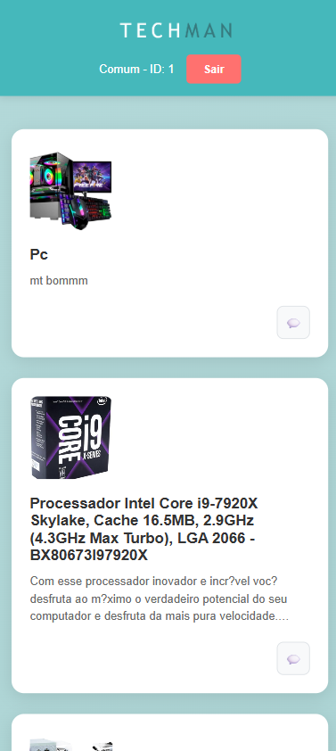
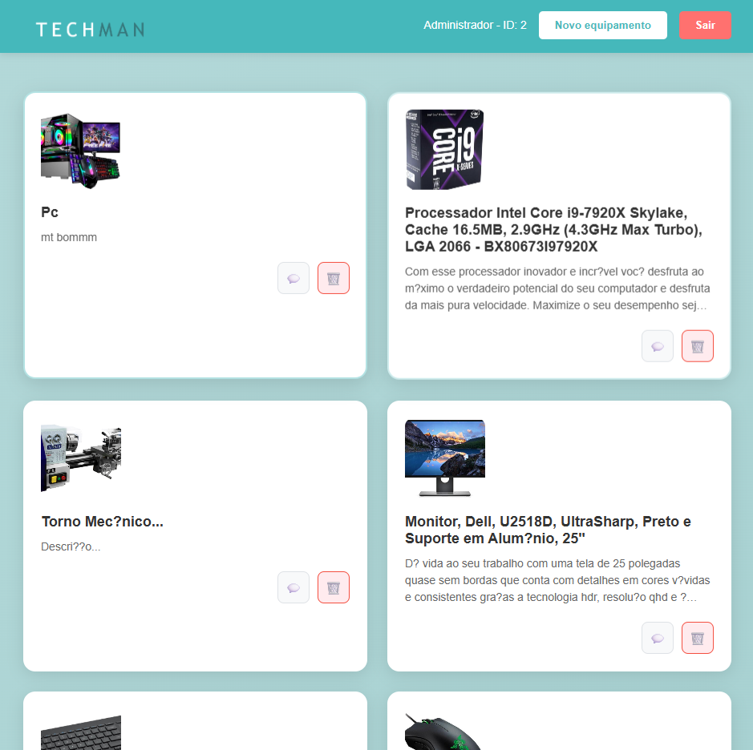
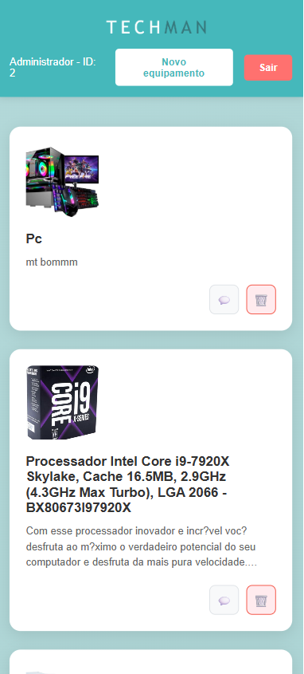
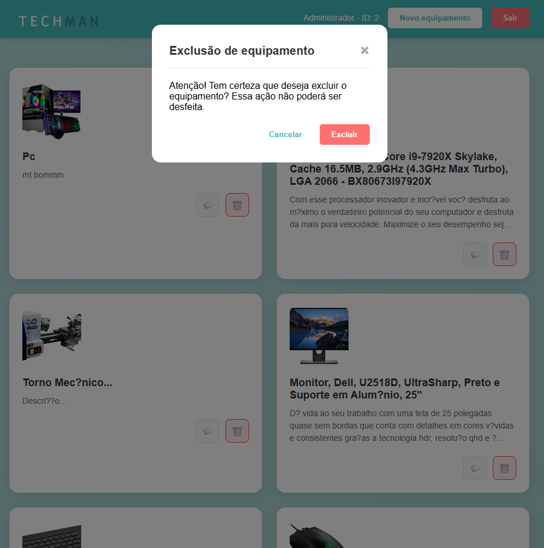
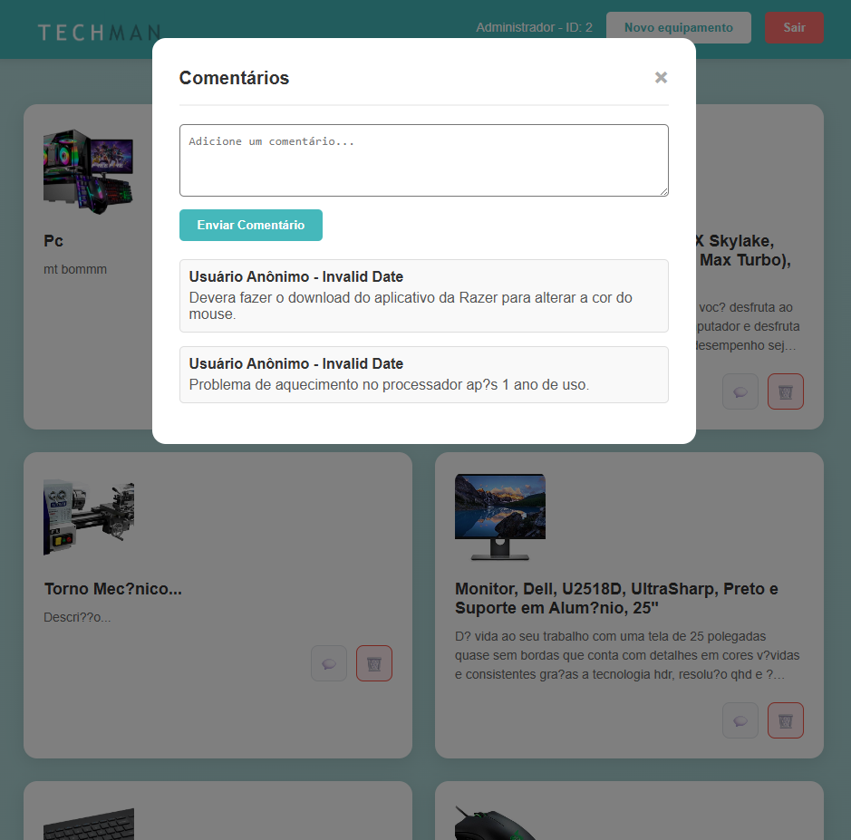

## Fronte-End da Techman


## Requisitos

- **Plataforma:** Web (Front-end).
- **Linguagem:** O código principal do aplicativo deve ser escrito em HTML, CSS e JavaScript 

## Funcionalidades

### 1. Tela de Login

- Crie uma tela de login com campos para usuário digitar sua senha.

### 2. Tela de Listagem de Equipamentos

- Após o login, a primeira tela deve exibir uma lista de equipamentos em forma de cards.
- Cada item da lista deve exibir o título do post.

### 4. Funcionalidade de Deletar e Comentar
- Apenas os administradores podem deletar os equipamentos, os demais so podem comentar

### 5. Responsividade UX

- A interface deve ser responsiva e funcionar bem em dispositivos móveis e desktops.
- Utilize boas práticas de design responsivo, como media queries e flexbox ou grid layout.

## Estrutura do Projeto

- Organize o código-fonte em uma estrutura clara e coesa:

```
/index.html
/index.css
/index.js

/equipamentos.html
/equipamentos.css
/equipamentos.js
```

## Login

## Login Responsivo

## Equipamentos

## Equipamentos Responsivo

## Equipamentos(ADM)

## Equipamentos Responsivo(ADM)

## Exclusão de Equipamentos 

## Comentarios 
